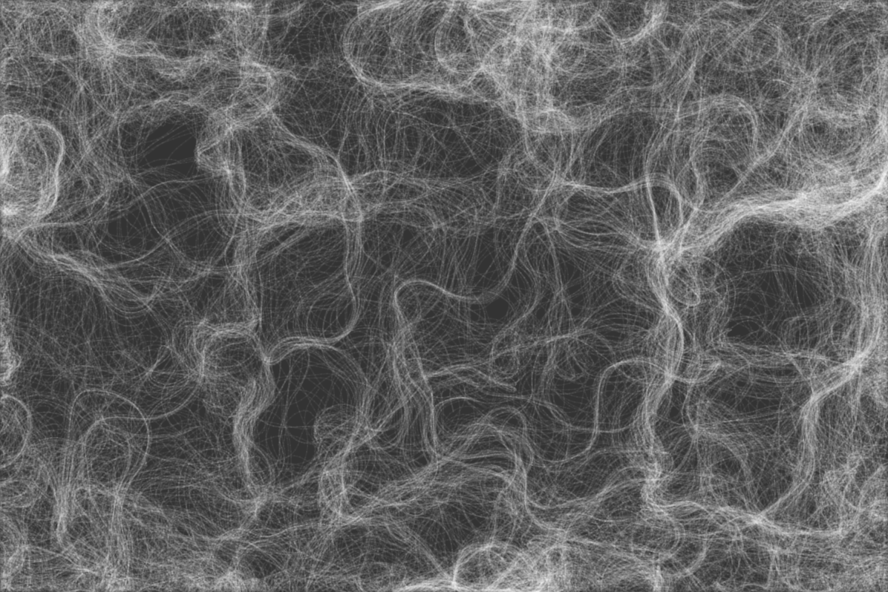
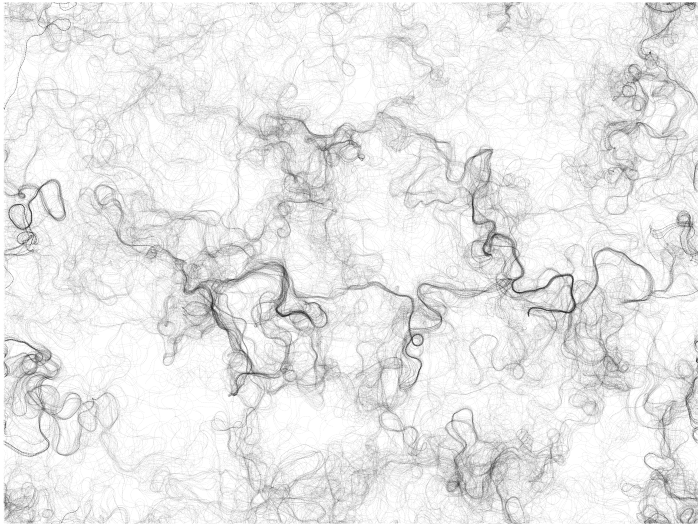

# Quiz 8 – Design Research

## Part 1: Imaging technique inspiration

I plan to reference *The Coding Train – Perlin Noise Flow Field*, where hundreds of particles follow a continuous vector field generated by Perlin noise. The result is an organic, coherent motion that feels alive yet ordered. For my project, I intend to adapt this principle to a concentric, polar layout: instead of free particles, each ring in my “Wheels of Fortune” will become a structured lane whose rotation, wobble, and segment phase are driven by sampled noise. This will merge structural order (rings and wedges) with lifelike dynamics (field-driven motion).

[Perlin Noise Flow Field / The Coding Train](https://thecodingtrain.com/challenges/24-perlin-noise-flow-field)

---

## Part 2: Coding technique exploration

I will combine **polar-coordinate layouts** with **Perlin noise (p5.js noise)**.  
Polar math (r, θ → x, y) makes concentric rings and wedge segmentation straightforward and parameterized.  
Perlin noise introduces smooth, organic variations in radius, angle, texture density, and hue, producing natural motion without harsh randomness.  
Together, these techniques preserve the structural order of the wheels while enabling subtle, dynamic animation suitable for audio, time, noise, or input-driven variations.

  
https://www.youtube.com/watch?v=ZI1dmHv3MeM

**References:**  
- [Perlin noise (Coding Train)](https://thecodingtrain.com/tracks/the-nature-of-code-2/noc/perlin/intro-to-perlin-noise)
	- code: https://p5js.org/examples/repetition-noise/
- [Polar Coordinates (Coding Train)](https://thecodingtrain.com/tracks/the-nature-of-code-2/noc/3-angles/4-polar-coordinates)
	- code: https://github.com/liz-peng/p5.Polar

